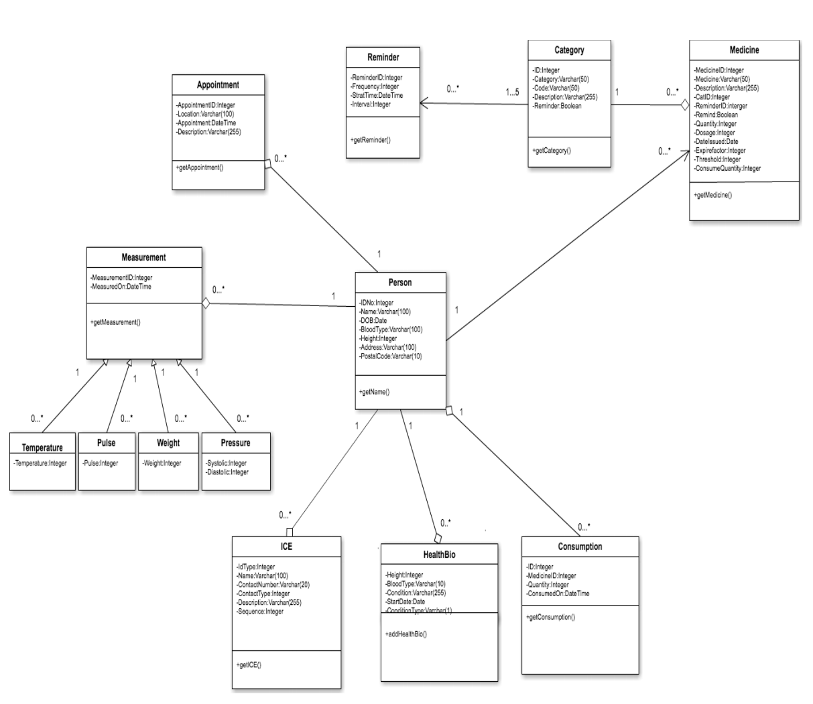

# Medipal-Personal health tracker

Medical is personal health tracker android application developed by team of 5 students including me as per the requirements.

## User interface (UI):

UI of this application is simple which can be easily used by an elderly.

- #### **Help screens:**

  - UI will first show help screens to guide user on how to use app

- #### **Data forms:**

  **Below is list of data form to be filled by user to track his history.**

  1. Personal bio form
  2. Health bio form
  3. Medication categories (“supplement” ,”chronic”, “incidental”, “complete course”, etc.).
     Each category is identified by a “category id”, which is a three-letter code
     (e.g. “SUP” for “supplement”). A category will exist in one or more medicine.)
  4. Medicine form (Where user can add medicine he has to take and time at which he has to take)
  5. Consumption form (Quantity of medicines and time at which they consumed)
  6. Medical appointments form (Hospital and appointment date and time)
  7. ICE (In case of Emergency Contact):
     This entity will keep track of the contact person, contact number (with possible dial
     capability), contact person’s address, description or remarks. User should be able to
     categorise the ICE information to whether it is an emergency number, home physician
     (general practitioner), next of kin (NOK).
  8. Manage Measurements:
     The app should allow users to select the different types of health measurements they want
     to record. In this assignment, we will only be recording the following measurements.
     Type Measurement Measurement Unit
     Vital Blood Pressure - Systolic mm Hg - Diastolic mm Hg - Pulse bpm - Temperature Degree Celsius - Weight kg
     Users should be able to capture these measurement information proposed for future
     reviews. Users should be able to make notes on each measurement.
  9. Reporting (Optional)
     The system must be able to consolidate all the different records that are captured and output
     to the screen in some simple reporting format; i.e. listing of recorded values.
     `- Measurement for blood pressure
     - Measurement for cholesterol level
     - Measurement for weight
     - Measurement for glucose level
     - Consumption of medication`

## Data Storage:

1. In-memory database like SQLite is used to store user information
2. All information is stored on users phone there is not external connection is required
3. Due to this approach user do not need to have data connectivity on his phone

## Application design (Class diagram):

> 

## DEMO

[Short app video](http://bit.ly/2EhoLAt)

## Any problem, suggestions?

> vipul.zambare1993@gmail.com
